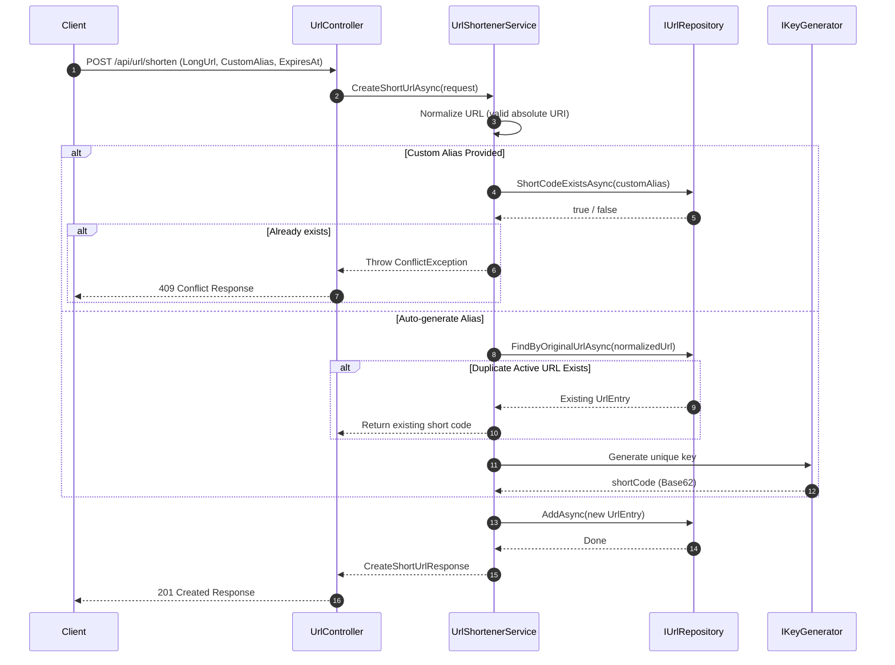
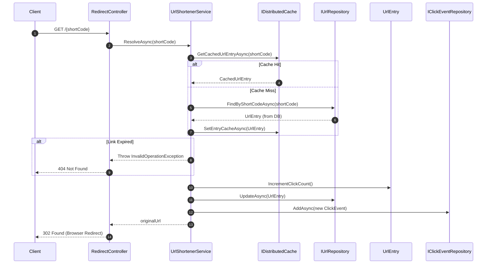

# LinkSwift System Architecture & Low-Level Design

This document details the software architecture, design patterns, component workflows, and algorithms used in the LinkSwift URL Shortener system.

---

## 1. Swagger UI URL

The interactive Swagger API documentation can be accessed at:
*   **Local Development**: `https://localhost:5001/swagger`
*   **Production Deployment**: `https://linkswift-api.onrender.com/swagger`

---

## 2. Architecture & Directory Structure

The backend follows the **Clean Architecture** (Layered Architecture) pattern, dividing the system into distinct concern layers to isolate core business rules from external frameworks, databases, and APIs.

```
                  ┌───────────────────────┐
                  │   UrlShortener.Api    │  (Controllers, Middlewares, DI)
                  └───────────┬───────────┘
                              │
                              ▼
                  ┌───────────────────────┐
                  │   UrlShortener.Core   │  (Entities, DTOs, Contracts, Services)
                  └───────────▲───────────┘
                              │
                              │ (implements)
                  ┌───────────┴───────────┐
                  │UrlShortener.Infrastructure│  (DB Context, EF Repos, Redis)
                  └───────────────────────┘
```

*   **[UrlShortener.Core](file:///Users/shivansh/projects/url-shortener/UrlShortener.Core)**: The innermost layer containing domain models, Data Transfer Objects (DTOs), interface contracts, and core business rules. It has zero external dependencies on frameworks or databases.
*   **[UrlShortener.Infrastructure](file:///Users/shivansh/projects/url-shortener/UrlShortener.Infrastructure)**: Implements contracts declared in Core. Handles persistence (EF Core, Npgsql, PostgreSQL), caching (Redis), and cryptographic key generation.
*   **[UrlShortener.Api](file:///Users/shivansh/projects/url-shortener/UrlShortener.Api)**: The entry point layer containing Controllers, JWT authentication configurations, and middleware pipelines.

---

## 3. Design Patterns Used

### 1. Strategy Pattern
*   Used for generating short URL keys.
*   The abstraction `IKeyGenerator` defines a contract for key generation. The concrete strategy `Base62KeyGenerator` implements this using cryptographically secure random base62 strings. This allows easy swap-in of alternative generation strategies (e.g., hash-based, snowflake ID, database auto-increment) without modifying the main service.

### 2. Repository Pattern
*   Used to decouple business logic from persistence frameworks.
*   Core services depend on `IUrlRepository` and `IClickEventRepository`. Infrastructure implements these via:
    *   `EntityFrameworkUrlRepository` / `EntityFrameworkClickEventRepository` for production Neon PostgreSQL database.
    *   `InMemoryUrlRepository` / `InMemoryClickEventRepository` for fast thread-safe unit testing.

### 3. Dependency Injection (IoC)
*   Promotes loose coupling by registering dependencies in `Program.cs`. 
*   High-level services receive abstractions (e.g., `IUrlRepository`, `IKeyGenerator`) in their constructors, adhering to the Dependency Inversion Principle.

---

## 4. Key Implementation Details

### Database & Schema Configuration
- Built using **Entity Framework Core** mapping onto **Neon serverless PostgreSQL**.
- Maps [UrlEntry](file:///Users/shivansh/projects/url-shortener/UrlShortener.Core/Entities/UrlEntry.cs) to the existing database table `UrlMappings` for schema backward-compatibility.
- Primary tables include:
  - `UrlMappings`: Stores URL entries, creators, expiration dates, custom aliases, and raw scan/click counts.
  - `ClickEvents`: Logs each redirect with timestamp, referrer website, and visitor country.
  - `UserProfiles` / `AppUsers`: Stores user accounts, API keys, and settings.

### Caching Strategy (Redis)
- To achieve low-latency link resolution, the system uses a **cache-aside pattern** with Redis.
- Resolving a short link queries Redis first. If it's a cache hit, the redirection occurs immediately. On a cache miss, the database is queried, and the result is written to Redis.
- Caches expire automatically upon link expiration (`ExpiresAt`) or default to 1-minute TTL for expired/inactive links.

---

## 5. Request Workflows

### A. URL Shortening Flow (POST `/api/url/shorten`)



### B. URL Redirection Flow (GET `/{shortCode}`)



---

## 6. URL Shortening Algorithm

LinkSwift uses **Base62 Encoding Strategy** to generate unique, compact keys for short URLs.

### Why Base62?
The character set contains 62 alphanumeric characters: `a-z` (26), `A-Z` (26), and `0-9` (10). Using 62 characters avoids URL-unsafe symbols (like `+`, `/`, `=` in Base64), making the short codes completely safe for web routes without encoding.

### The Algorithm:
1.  **Entropy Generation**: A 7-byte buffer is filled with cryptographically secure random bytes generated using `RandomNumberGenerator`.
2.  **Character Selection**: Each byte is projected onto the alphabet modulo 62:
    $$\text{char} = \text{Alphabet}[\text{byte} \pmod{62}]$$
3.  **String Construction**: These characters are joined to build a 7-character string.
    *   A 7-character Base62 string yields $62^7 \approx 3,521,614,606,208$ (3.5 Trillion) unique combinations.
4.  **Collision Handling**: The generator retries up to 5 times if a collision is found in the database.
